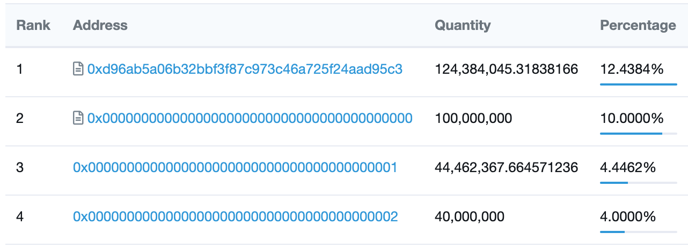
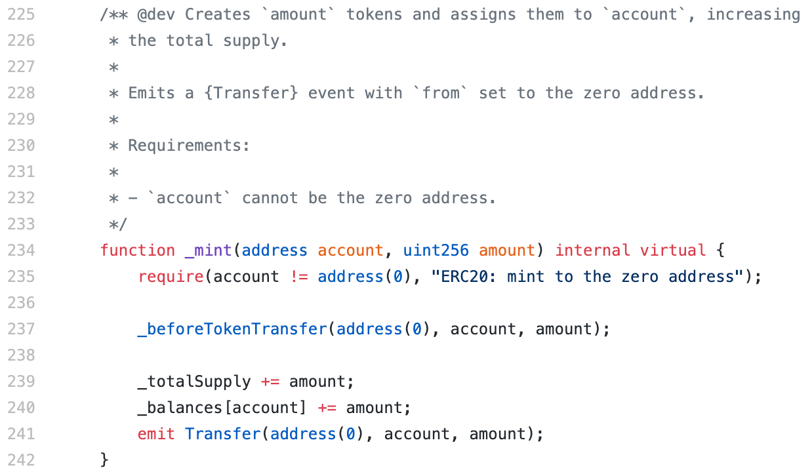
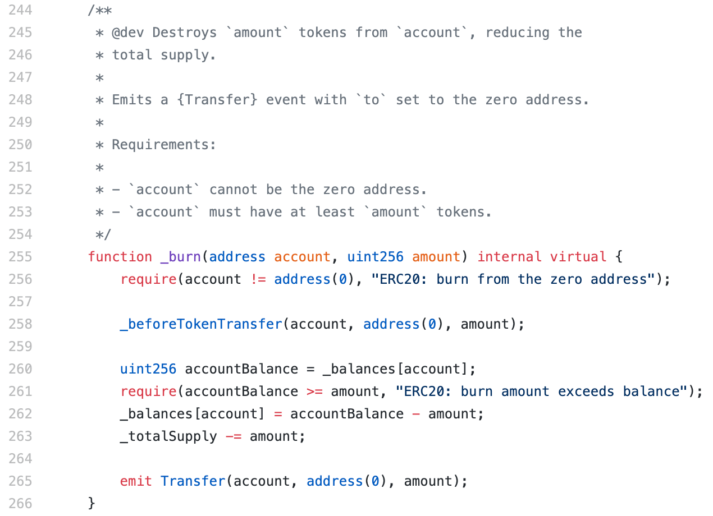
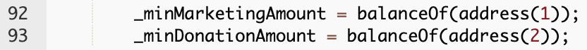
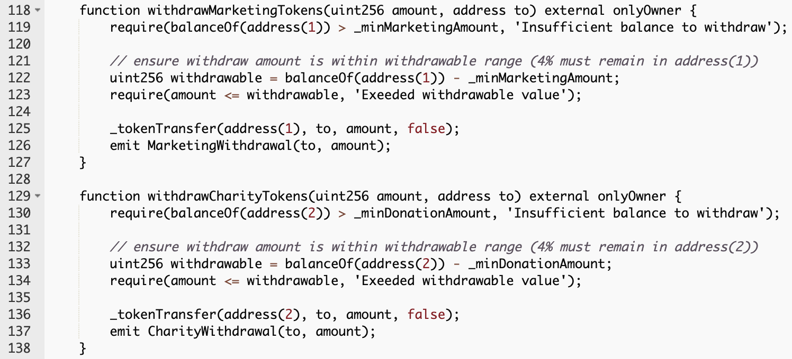
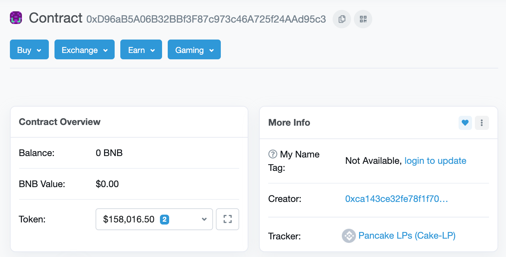
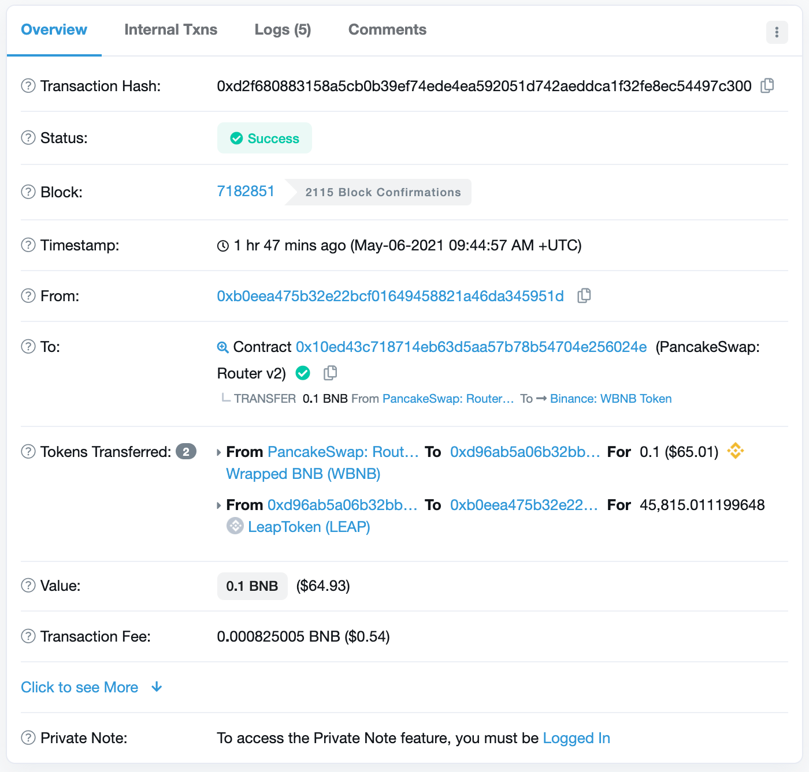

We’re excited to release [LEAP token](https://bscscan.com/token/0x153aaf397d37a20efa9dc46e4cba42583cb0007a). In our whitepaper, we mentioned that 10% tokens are distributed to burn wallet, 4% tokens are distributed to both marketing and charity wallet.

Keep reading below for a better understanding on how the top wallet works.

---

# Burn Wallet

For ERC-20 tokens, it is the standard practise to make use of address(0), for both mint and burn purposes. Let's have a look at OpenZeppelin's implementation of ERC-20 [here](https://github.com/OpenZeppelin/openzeppelin-contracts/blob/master/contracts/token/ERC20/ERC20.sol).

From the implementation, we can see that when minting a token, a transfer event is emitted to indicate that the address(0) has sent tokens to the recipient. Whereas for burn, a transfer event is emitted to indicate that an address has sent tokens to address(0) to be burnt.

# Marketing Wallet and Charity Wallet

0x0000000000000000000000000000000000000001 - Marketing Wallet  
0x0000000000000000000000000000000000000002 - Charity Wallet

During LEAP Token's genesis, 40 million LEAP tokens are allocated to both Marketing Wallet and Charity Wallet. This 40 million are then locked. In Leap.sol, we can see that in the constructor, 40 million is set as the minimum marketing and charity amount.

In the function withdrawCharityTokens and withdrawMarketingTokens, the smart contract will check and require that the withdraw amount is lesser than the locked amount.

# PancakeSwap Liquidity Pool

0xd96ab5a06b32bbf3f87c973c46a725f24aad95c3 is the address of LEAP:BNB PancakeSwap liquidity pool. Whenever you swap BNB for LEAP, this is what happens:

1. BNB is sent from your address to PancakeSwap router 0x10ed43c718714eb63d5aa57b78b54704e256024e to be wrapped. 
2. PancakeSwap Router sends wrapped BNB (WBNB) to the LEAP:BNB LP 0xd96ab5a06b32bbf3f87c973c46a725f24aad95c3
3. LEAP:BNB LP 0xd96ab5a06b32bbf3f87c973c46a725f24aad95c3 sends LEAP to your wallet address.