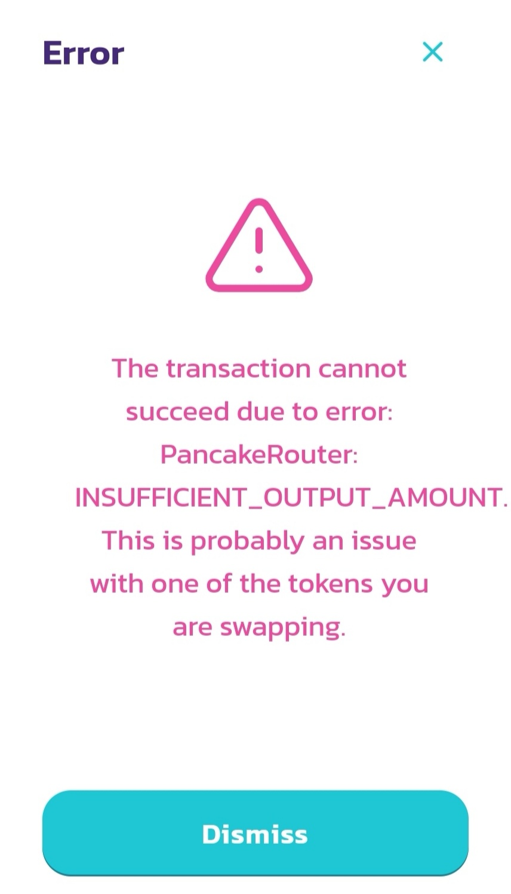

<Info>Didn't find an answer? Join the <a href="https://discord.gg/9mP4637ZFD">community Discord</a> to get support</Info>

# How do I purchase LEAP token?

First you'll need a BNB Wallet such as Metamask, ImToken, or Trust Wallet, some [BNB](https://www.binance.com/en/buy-BNB). Once completed, head over to [PancakeSwap](https://pancakeswap.finance/) to swap BNB for LEAP. Remember that each transaction on Binance Smart Chain costs BNB (this is called the ["gas fee"](https://www.youtube.com/watch?v=AJvzNICwcwc&feature=emb_title) and it's paid to miners to keep the network running).

# How does PancakeSwap work?

PancakeSwap is an [automated liquidity protocol](https://ethereum.org/en/get-eth/#dex). In practical terms this means there are template smart contracts that define a standard way to make [liquidity pools](https://uniswap.org/docs/v2/core-concepts/pools) and corresponding markets that are compatible with eachother. There is no orderbook, no centralized party and no central facilitator of trade. Each pool is defined by a smart contract that includes a few functions to enable swapping tokens, adding liquidity and more. At its core each pool uses the function `x*y=k` to maintain a curve along which trades can happen. The pools keep track of reserves(liquidity) and updates those reserves every single time someone trades. Because the reserves are automated rebalanced a PancakeSwap pool can always be used to buy or sell a token without required a counterparty on the other side of your trade.

# My swap failed with code "INSUFFICIENT_OUTPUT_AMOUNT", what happened?

If a swap failed with INSUCCIFIENT_OUTPUT_AMOUNT, remember that [Slippage tolerance](https://docs.pancakeswap.finance/click-here-for-help/troubleshooting-errors) need to be set to a minimum of 11%.

# Why Presales?
We need to raise 50 BNB (for 200m LEAP) in order to provide liquidity to PancakeSwap. We choose to crowdfund this 50 BNB instead letting someone sponsor us directly as letting someone sponsor us directly would mean that the sponsor will own 200m (20%) of LEAP. Instead, by crowdfunding this 50 BNB, each wallet is limited to 0.5 BNB, 1m (0.2%) of LEAP. This minimizes the risk of whales dumping.

You can participate in the presales either via the [presales](/presales) page or by interacting directly with the smart contract via [bscscan](https://bscscan.com). The 50 BNB sent to LEAP smart contract will not be accessible in any way by the dev other than using it for LP provision or refunding (if crowdfund target is not reached).