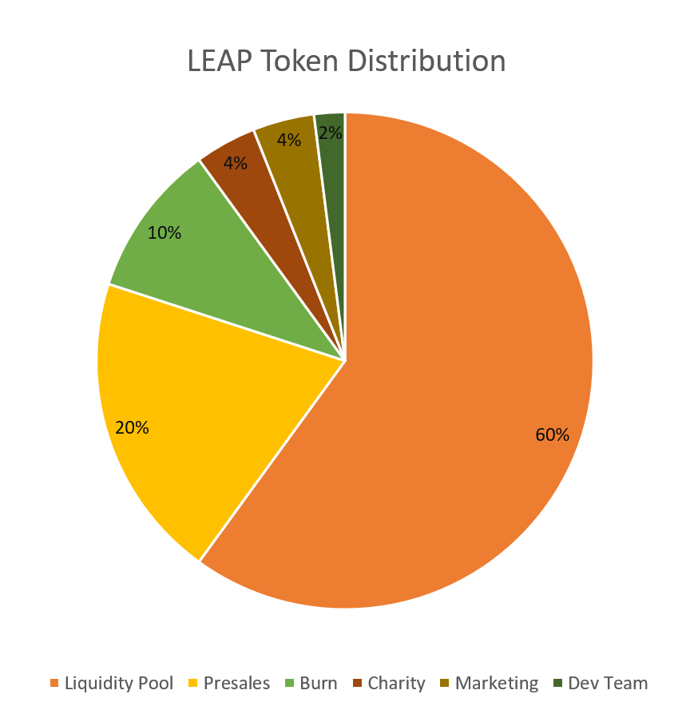

**Community-Driven Fair Token Initiative**

_NOTE: This document is under development. Please check regularly for updates!_

## Table of Contents
- [Motivation](#motivation)
- [Design Principles](#design-principles)
- [Token Economy](#token-economy)
  * [Token Distribution](#token-distribution)
  * [Staking by Holding](#staking-by-holding)
  * [Automatic Burn](#automatic-burn)
  * [Liquidity Pool](#liquidity-pool)
  * [Charity](#charity)
# Motivation
Leap Protocol is designed with fairness as the core principle. A token which is designed to be fair, and to help those in needs.

# Design Principles
## Binance Smart Chain
LEAP token, the token for Leap Protocol, is developed on top of the Binance Smart Chain (BSC) as a token that follows the BEP-20 standard. Similar to the Ethereum network, the BSC blockchain network features smart contract functionality and is compatible with the Ethereum Virtual Machine (EVM). This means that Ethereum users won't notice dramatic differences while interacting with applications on BSC.  

While BSC shares many similarities with Ethereum, the BSC network offers two main advantages over the Ethereum network:  
1. Low gas fees. Due to the soaring network traffic on the Ethereum network and the recent ETH price rally, it is not uncommon for users to pay up to $150 in gas fees to perform a transaction. On the BSC network, gas fees are negligible and rarely exceeds $0.1 for a transaction.
1. Fast transaction speed. The BSC network adopted the Proof-of-Staked-Authority (PoSA) consensus algorithm in contrast to Ethereum's Proof-of-Work (PoW). In the PoSA consensus, miners are replaced with 21 validators. This enables BSC to have a significantly faster block time of 3 seconds while Ethereum requires 13.14 seconds to produce a block. With 21 validators, the ⅔\*N+1 different validator seals will need a time period of (⅔\*21+1)*3 = 45 seconds. Whereas for Ethereum it will take (⅔\*21+1)*13.14 = 197.1 seconds.

Other notable differences between BSC and Ethereum are summarized as follows:

|               | Ethereum      | Binance Smart Chain (BSC)  |
| ------------- |:-------------:|:------------:|
| Native currency     | ETH         | BNB      |
| Token standard      | ERC-20      |   BEP-20 |
| Consensus algorithm | Proof-of-Work. Miners include transactions to the blockchain by contributing computational effort. Miners are incentivize with ETH by the network. | Proof-of-Staked-Authority. 21 validators that are rotated periodically stake their BNB to sign and commit new blocks to the blockchain. Malicious actors will have their asset "slashed". |
| Decentralized exchange | Uniswap  | Pancakeswap  |

## Fairness
With Leap Protocol, everyone has an equal opportunity. A fair public presales will be held where everyone, including the developers of this project, will have equal chances to acquire the presales tokens. Mechanisms built into LEAP to ensure fairness include:  
1. AMA sessions will be held to allow users to better understand the project.
1. Smart contract will be deployed 48 hours prior to the presales, giving users ample time to inspect it.
1. A total of 200 million LEAP tokens will be sold during presales to raise 50 BNB.
1. Each wallet is capped at contributing 0.5 BNB during presales.
1. In the event that presales fail to raise 50 BNB, all the BNB will be refunded to the participants.

## Security
Security and safety of users' funds and investments are top priorities in Leap Protocol. The security and safety features are built right in the LEAP smart contract. This allows everyone to easily audit and inspect the trustworthiness of LEAP. 

### Presales Mechanism
During presales, the contributions and withdrawable presales tokens amount are carefully tracked by the smart contract. In the event when a user contributed an amount that causes the total contributions to exceed the capped 50 BNB, the balance will be returned to the user.

### Maximum Tax Fees
Transactions of LEAP are taxed with a fee. Although the tax fee is a variable that can be tuned by the dev team, a maximum tax fee of 10% of the transaction amount is set in the smart contract. This means that users cannot be taxed more than 10% of the transaction amount.

### Maximum Transaction Limit
Every transaction of LEAP is limited to 10 million LEAP. This discourages whales from mass dumping or mass pumping.

### Liquidity Provider Token Time Lock
The Pancakeswap Liquidity Provider (LP) tokens will be sent into the LEAP smart contract to be locked for a certain period of time. Building this anti-rugpull mechanism without relying on third party services introduces another level of security. Locking the LP tokens in the smart contract allows this to be easily verified on the bscscan blockchain explorer. The immutability property of smart contracts ensures that the LP tokens cannot be removed before the set deadline.

<!-- 1. **BEP-20**: BEP-20 (Binance Smart Chain) is chosen over ERC-20 (Ethereum) for a few reasons, namely: low gas fee and fast transaction speed (block-time of 3s as compared to 13.14s in Ethereum). With 21 validators, if the block time is 3 seconds, the ⅔\*N+1 different validator seals will need a time period of (⅔\*21+1)*3 = 45 seconds. Whereas for Ethereum it will take (⅔\*21+1)*13.14 = 197.1 seconds.
2. **Fairness**: 
3. **Security**:  -->

# Token Economy
10% of every transaction will be distributed to all token holders excluding the PancakeSwap Liquidity Pool, based on the percentage of tokens holders own.

## Token Distribution
Leap protocol employs a fair distribution. On contract deployment, the token supply will be distributed as follows:
- 10% burn
- 4% charity
- 4% marketing
- 2% dev team
- 20 % presales
- 60% liquidity pool

## Automatic Farming
Per transaction, 10% of LEAP will be redistributed to all LEAP holders, excluding PancakeSwap Liquidity Pool.

## Automatic Burn
The burn wallet which holds 10% of the total supply is part of the token redistribution. As the amount of Leap increases in this burn wallet per transaction, burn rate will increase exponentially over time.

## Liquidity Pool
60% of total supply is added to the liquidity pool. This prevents the need from having to increase the liquidity pool, which maximizes the token redistribution that token holder will receives.

## Charity
Leap Protocol's core principle is about fairness. LEAP community will vote for how the charity pool is used and who it will be used for.

------
